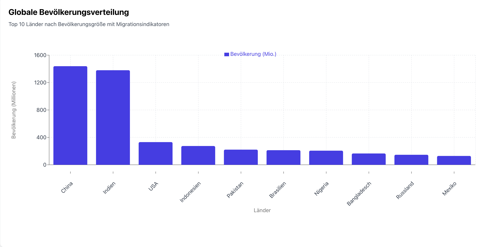
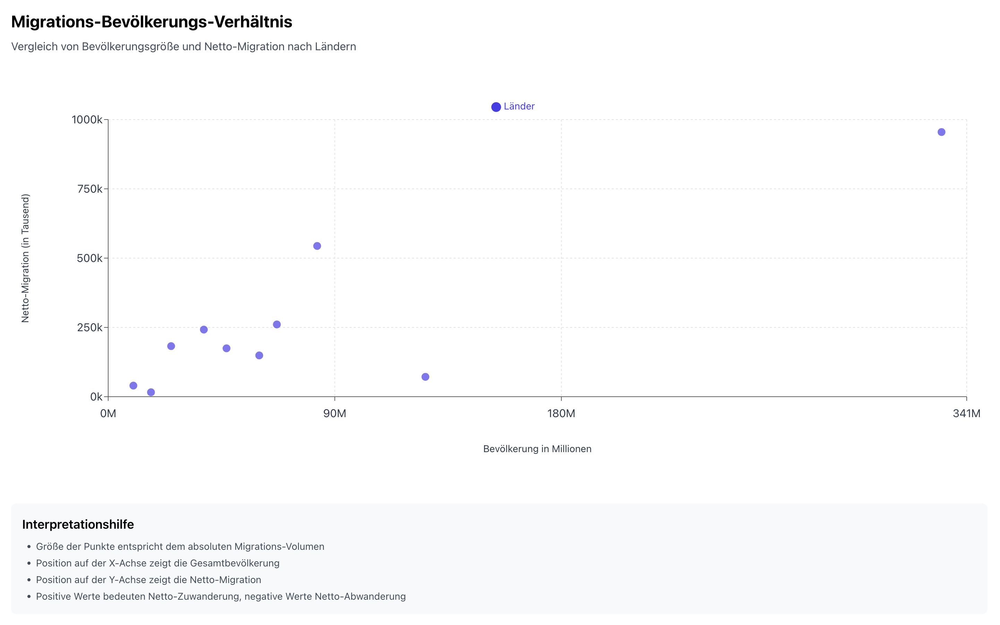

# 🌍 Globale Bevölkerungsmigration Analyse

## 📊 Projektübersicht
Dieses Projekt analysiert die globalen Migrationsmuster und Bevölkerungsentwicklungen von 186 Ländern. Die interaktiven Visualisierungen und tiefgehende Analyse bieten Einblicke in weltweite demografische Trends und Migrationsbewegungen.

## 🎯 Haupterkenntnisse

### Bevölkerungsverteilung

- Die Top 3 bevölkerungsreichsten Länder machen über 3 Milliarden Menschen aus
- Asiatische Länder dominieren die Top 10 Liste
- Große Unterschiede in der Bevölkerungsgröße (129 bis 1439 Millionen)

### Migrationsmuster

- Negative Nettozuwanderung in den bevölkerungsreichsten Ländern
- Entwickelte Länder zeigen überwiegend positive Migrationsraten
- Keine direkte Korrelation zwischen Bevölkerungsgröße und Migrationssaldo

## 🛠 Technischer Stack
- Python & Pandas für Datenverarbeitung
- React & Recharts für interaktive Visualisierungen
- Tailwind CSS für das Styling
- Jupyter Notebooks für explorative Analyse

## 📂 Projektstruktur
```
global_population_migration/
│
├── data/                              # Datensätze
│   ├── world_pop_mig_186_countries.csv      # Rohdaten
│   └── analyzed_*.csv                       # Analysierte Daten
│
├── src/                               # Quellcode
│   ├── components/                          # React Komponenten
│   └── data_processing/                     # Python Skripte
│
├── notebooks/                         # Jupyter Notebooks
│   └── exploratory_data_analysis.ipynb      # Datenanalyse
│
├── images/                            # Visualisierungen
│   ├── population_distribution.png
│   └── migration_trends.png
│
└── README.md                          # Projektdokumentation
```

## 🚀 Installation & Start

1. **Klonen Sie das Repository:**
   ```bash
   git clone https://github.com/yourusername/global_population_migration.git
   cd global_population_migration
   ```

2. **Python-Umgebung einrichten:**
   ```bash
   python -m venv venv
   source venv/bin/activate  # Unix
   pip install -r requirements.txt
   ```

3. **Node.js Abhängigkeiten installieren:**
   ```bash
   npm install
   ```

4. **Anwendung starten:**
   ```bash
   npm start
   ```

## 📊 Interaktive Visualisierungen

Die Visualisierungen bieten:
- Dynamische Darstellung der Bevölkerungsverteilung
- Interaktive Migrationsmuster-Analyse
- Detaillierte Tooltips mit Länderinformationen
- Responsive Designs für verschiedene Bildschirmgrößen

## 📈 Datenquellen
- UN Population Division
- World Bank Development Indicators
- International Migration Database

## 📝 Lizenz
Dieses Projekt ist unter der MIT-Lizenz lizenziert.